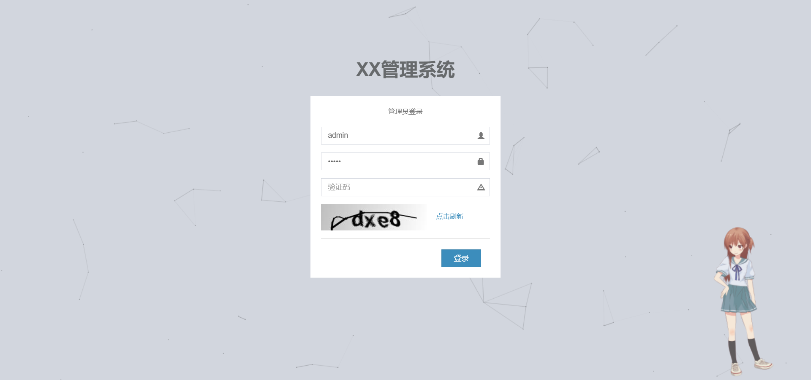
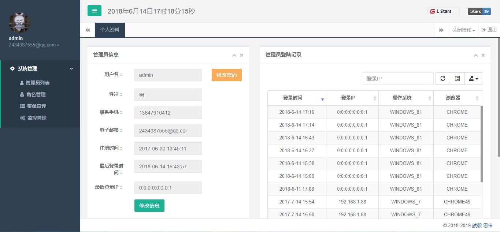
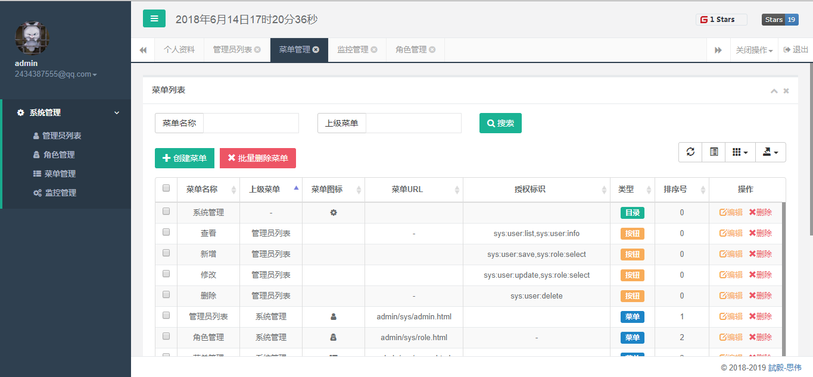
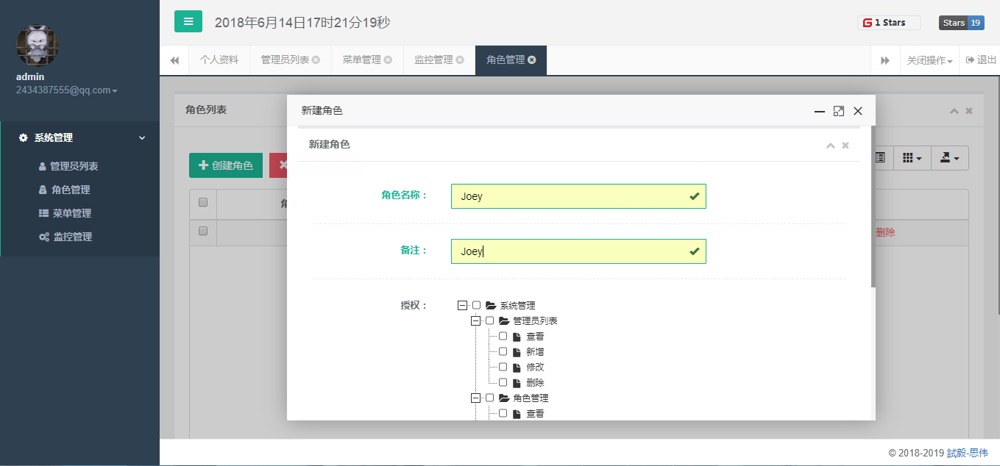

# 基于SpringBoot + Shiro + MyBatisPlus的权限管理框架

> **GitHub：[https://github.com/JoeyBling/bootplus](https://github.com/JoeyBling/bootplus)**

> **码云：[https://gitee.com/zhousiwei/bootplus](https://gitee.com/zhousiwei/bootplus)**


------------------

> 欢迎使用和Star支持，如使用过程中碰到问题，可以提出[Issue](https://gitee.com/zhousiwei/bootplus/issues)，我会尽力完善

## 介绍

&emsp;&emsp;`bootplus`是基于`SpringBoot + Shiro + MyBatisPlus`的权限管理框架
- （此项目只进行Bug修复，不再添加新功能实现）

> `SpringBoot`2.x集成例子请参考[bootplus_2.x](https://github.com/JoeyBling/bootplus/)

## 项目结构

```lua
bootplus
├── sql  -- 项目SQL语句
│
├── App -- 项目启动类
│
├── common -- 公用模块
|    ├── enums -- 枚举工具类
|    ├── serializer -- 自定义序列化实现
|    ├── typehandler -- 自定义MyBatis类型转换器
│
├── config -- 配置信息
|    ├── aop -- Spring AOP深入实现
|    ├── filter -- 过滤器
|    ├── interceptor -- 拦截器
|    ├── listener -- 监听器
│
├── controller -- 控制器
|    ├── admin -- 后台管理员控制器
│
├── dao -- 数据访问接口
│
├── entity -- 数据持久化实体类
│
├── frame -- 框架公用模块
|    ├── cache -- 缓存模块
|    ├── controller -- 控制器
│
├── service -- 业务逻辑接口
|    ├── impl -- 业务逻辑接口实现类
│
├── shiro -- Shiro验证框架
│
├── task -- 定时任务
│
├── util -- 工具类
|    ├── config -- 公用配置
|    ├── encry -- 加解密模块
|    ├── exception -- 自定义异常
|    ├── file -- 文件工具类
|    ├── freemaker -- 自定义FreeMarker标签
|    ├── http -- http模块实现
|    ├── log -- 日志模块
|    ├── sketch -- 字体、素描、图像
|    ├── spring -- spring公用模块
│
├── resources
|    ├── conf -- 不同环境配置
|    ├── file -- 模板文件
|    ├── jdk_fonts -- JDK字体
|    ├── mapper -- SQL对应的XML文件
│
├── webapp
|    ├── statics -- 静态资源(css、js...)
|    ├── upload -- 上传文件
|    ├── WEB-INF
|    |    ├── templates -- 页面FreeMarker模版
```

## 技术选型：
- 核心框架：`Spring Boot 1.5.1`
- 安全框架：`Apache Shiro`
- 视图框架：`Spring MVC`
- 持久层框架：`MyBatis`、`MyBatisPlus`
- 缓存技术：`EhCache`、`Redis`
- 定时器：`Quartz`
- 数据库连接池：`Druid`
- 日志实现：`SLF4J`、`Log4j`
- 模版技术：`FreeMarker`
- 页面交互：`BootStrap`、`Layer`等

## 本地部署：
- mysql执行[sql/bootplus.sql](./sql/bootplus.sql)文件，初始化数据
- 修改`application.yml`，更新`MySQL`连接信息,更新`Redis`连接信息（待实现）
- 项目访问路径：[http://localhost/admin](http://bootplus.diandianys.com/)
- 管理员账号密码：`admin/admin`


## 效果展示






## 捐赠
&emsp;&emsp;**如果感觉对您有帮助，请作者喝杯咖啡吧，请注明您的名字或者昵称，方便作者感谢o(*￣︶￣*)o**

| 微信 | 支付宝 |
| :---: | :---: |
|  |  |
