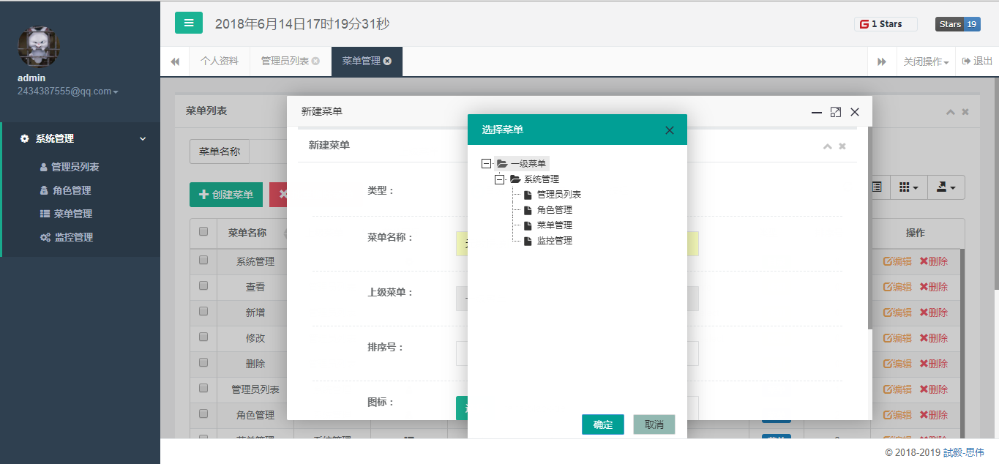

# 基于SpringBoot + Shiro + MyBatisPlus的权限管理框架

> **GitHub：[https://github.com/JoeyBling/bootplus](https://github.com/JoeyBling/bootplus)**

> **码云：[https://gitee.com/zhousiwei/bootplus](https://gitee.com/zhousiwei/bootplus)**

> **欢迎使用和Star支持，如使用过程中碰到问题，可以提出Issue，我会尽力完善**

# bootplus
- `bootplus`是基于`SpringBoot + Shiro + MyBatisPlus`的真正`restful URL`资源无状态认证权限管理框架

### 项目结构

```lua
bootplus
├── sql  -- 项目SQL语句
│
├── App -- 项目启动类
│
├── config -- 配置信息
│
├── controller -- 控制器
|    ├── admin -- 后台管理员控制器
│
├── service -- 业务逻辑接口
|    ├── impl -- 业务逻辑接口实现类
│
├── dao -- 数据访问接口
│
├── entity -- 数据持久化实体类
│
├── shiro -- Shiro验证框架
│
├── util -- 工具类
|    ├── FreeMarker -- 自定义FreeMarker标签
│
├── resources
|    ├── mapper -- SQL对应的XML文件
│
├── webapp
|    ├── statics -- 静态资源
|    ├── upload -- 上传文件
|    ├── WEB-INF
|    |    ├── templates -- 页面FreeMarker模版
```

### 技术选型：
- 核心框架：`Spring Boot 1.5.1`
- 安全框架：`Apache Shiro`
- 视图框架：`Spring MVC`
- 持久层框架：`MyBatis`、`MyBatisPlus`
- 缓存技术：`EhCache`、`Redis`
- 定时器：`Quartz`
- 数据库连接池：`Druid`
- 日志管理：`SLF4J`、`Log4j`
- 模版技术：`FreeMarker`
- 页面交互：`BootStrap`、`Layer`等

### 本地部署：
- mysql执行`sql/bootplus.sql`文件，初始化数据
- 修改`application.yml`，更新MySQL连接信息
- 项目访问路径：http://localhost/admin
- 管理员账号密码：`admin/admin`

### 效果展示




